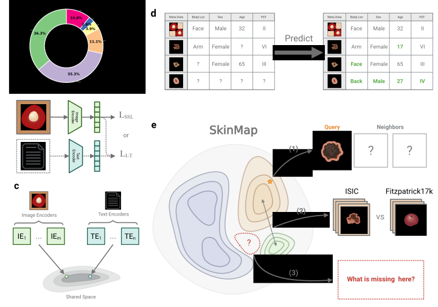

# SkinMap: A Global Atlas of Digital Dermatology to Map Innovation and Disparities

[](https://arxiv.org/abs/2601.00840)
[](https://doi.org/10.5281/zenodo.21454008)
[](https://huggingface.co/Digital-Dermatology/SkinMap)
[](https://opensource.org/licenses/Apache-2.0)

<p align="center">
  
</p>

The adoption of artificial intelligence in dermatology promises democratized access to healthcare, but model reliability depends on the quality and comprehensiveness of the data fueling these models. Despite rapid growth in publicly available dermatology images, the field lacks quantitative key performance indicators to measure whether new datasets expand clinical coverage or merely replicate what is already known. Here we present SkinMap, a multi-modal framework for the first comprehensive audit of the field's entire data basis. We unify the publicly available dermatology datasets into a single, queryable semantic atlas comprising more than 1.1 million images of skin conditions and quantify (i) informational novelty over time, (ii) dataset redundancy, and (iii) representation gaps across demographics and diagnoses. Despite exponential growth in dataset sizes, informational novelty across time has somewhat plateaued: Some clusters, such as common neoplasms on fair skin, are densely populated, while underrepresented skin types and many rare diseases remain unaddressed. We further identify structural gaps in coverage: Darker skin tones (Fitzpatrick V-VI) constitute only 11.0% of images and pediatric patients only 2.3%, while many rare diseases and phenotype combinations remain sparsely represented. SkinMap provides infrastructure to measure blind spots and steer strategic data acquisition toward undercovered regions of clinical space.

## Table of Contents

- [Features](#features)
- [Installation](#installation)
- [Quick Start](#quick-start)
- [Training](#training)
- [Analysis Metrics](#analysis-metrics)
- [Docker Usage](#docker-usage)
- [Pretrained Model](#pretrained-model)
- [Reproducing the Atlas](#reproducing-the-atlas)
- [Authors](#authors)
- [Contributing](#contributing)
- [Citation](#citation)
- [License](#license)

## Features

- **Unified Data Atlas**: Integration of 29 public dermatology datasets comprising 1.1+ million images
- **Multi-Modal Framework**: Combines self-supervised learning (SSL) and vision-language models (CLIP/SigLIP)
- **Metadata Imputation**: Prediction of missing demographic and clinical attributes via linear probes
- **Comprehensive Analysis**: Metrics for informational novelty, dataset redundancy, coverage, and representativeness
- **Gap Detection**: Identify underrepresented regions using topological data analysis
- **Strategic Data Acquisition**: Evidence-based guidance for future data collection
- **Distributed Training**: Multi-GPU support with automatic configuration

## Installation

### Local Installation

```bash
# Clone the repository
git clone --recursive https://github.com/Digital-Dermatology/skinmap-code.git
cd skinmap-code

# Install dependencies
pip install -r requirements.txt

# Install pre-commit hooks
pre-commit install
```

> **Notes for local installs.** Run the pipeline scripts under `src/` from the repo
> root with `PYTHONPATH=.` (they use `src.`-style imports), or use the Docker image
> below (which presets `PYTHONPATH`). `faiss` is listed as `faiss-cpu`; for GPU FAISS
> and the smoothest setup overall, use Docker. The `make` targets require `netstat`
> (install `net-tools`). **Docker is the recommended, fully-configured path.**

### Docker Installation

```bash
# Build the Docker image
make _build

# Run an interactive bash session
make run_bash
```

## Quick Start

The pipeline is keyed by `--model_name` (the teacher encoder); outputs are written
under `assets/<model_name>/`. Run from the repo root with `PYTHONPATH=.` (or inside
the Docker container, where it is preset).

> **Input.** `--data_csv` points to a CSV with at least an `img_path` column (path to
> each image) and a `description` column (text caption / label). It is built from the
> source datasets by `src/prep_data.py` — obtain the datasets under their own licenses
> first (see [Reproducing the Atlas](#reproducing-the-atlas)).

### 1. Build the embedding atlas

```bash
PYTHONPATH=. python src/create_skinmap.py \
  --model_name suinleelab/monet \
  --data_csv ./assets/data.csv \
  --use_atlas
# writes assets/suinleelab/monet/embeddings/{dataframe.csv, embeddings.npz}
#    and assets/suinleelab/monet/atlas_input.parquet
```

### 2. Run the analysis suite

```bash
PYTHONPATH=. python src/run_analysis.py --model_name suinleelab/monet
# reads assets/<model_name>/{atlas_input.parquet, embeddings/}
# writes results to assets/<model_name>/analysis/
```

> This Quick Start uses a single teacher (`suinleelab/monet`) to demonstrate the
> method end to end. Faithfully reproducing the **paper's** atlas uses the released
> 12-teacher ensemble — see [Reproducing the Atlas](#reproducing-the-atlas).

## Training

### Using Make (Recommended)

The easiest way to train CLIP models is using the Makefile, which automatically detects and uses all available GPUs:

```bash
# Basic training with defaults (uses all GPUs automatically)
make train_clip

# Override specific parameters
make train_clip TRAIN_DATA_CSV=./data/my_data.csv TRAIN_EPOCHS=20 TRAIN_BATCH_SIZE=128

# Specify which GPUs to use
GPU_ID=0,1 make train_clip  # Use GPUs 0 and 1

# Add extra arguments
make train_clip TRAIN_EXTRA_ARGS="--random_init --loss_type siglip"
```

#### Available Parameters

| Parameter | Default | Description |
|-----------|---------|-------------|
| `TRAIN_DATA_CSV` | `./assets/data.csv` | Path to training data CSV |
| `TRAIN_EPOCHS` | `10` | Number of training epochs |
| `TRAIN_BATCH_SIZE` | `256` | Batch size per GPU |
| `TRAIN_MODEL` | `suinleelab/monet` | Model name or path |
| `TRAIN_LR` | `5e-6` | Learning rate |
| `TRAIN_EXTRA_ARGS` | - | Additional arguments for `train_clip.py` |
| `GPU_ID` | `all` | Comma-separated GPU IDs |

### Hold-Out Datasets

By default, the training script **automatically excludes PAD-UFES-20 and DDI datasets** from training to ensure proper evaluation.

To customize hold-out datasets:

```bash
# Use different hold-out datasets
make train_clip TRAIN_EXTRA_ARGS="--holdout_datasets Dataset1 Dataset2"
```

### Manual Training

For advanced users, run training commands directly inside the Docker container:

```bash
# Single GPU
python src/train_clip.py --data_csv ./assets/data.csv --epochs 10 --batch_size 256 --fp16

# Multi-GPU with torchrun
torchrun --nproc_per_node=2 src/train_clip.py --data_csv ./assets/data.csv --epochs 10 --batch_size 256 --fp16
```

## Analysis Metrics

SkinMap provides comprehensive analysis metrics to evaluate embedding quality, identify data gaps, and guide data collection.
Metrics include:

- **Density Analysis**: KNN density, intersectional density, coverage metrics
- **Data Quality**: Duplicate detection, neighbor label agreement, label noise proxies
- **Temporal Analysis**: Yearly novelty tracking
- **Cross-Dataset**: Domain shift, transfer learning probes
- **Topology**: Hole detection via persistent homology

Run the full analysis suite:

```bash
PYTHONPATH=. python src/run_analysis.py --model_name <model_name>
```

For hole detection using topological data analysis:

```bash
# Synthetic data
python scripts/run_hole_detection.py synthetic --datasets shell --dimensions 64 --samples 20000

# Real embeddings
python scripts/run_hole_detection.py apply --input path/to.csv --columns embedding_0 ...
```

## Docker Usage

### Building and Running

```bash
# Build the Docker image
make _build

# Run bash session
make run_bash

# Start Jupyter notebook
make start_jupyter
```

### Environment Variables

Configure via `.env` file or command line:

- `GPU_ID`: GPU IDs to use (default: `all`)
- `PORT`: Jupyter notebook port (default: `8888`)
- `LOCAL_DATA_DIR`: Data directory to mount (default: `./data/`)
- `CONTAINER_NAME`: Custom container name

## Authors

Fabian Gröger¹,², Simone Lionetti², Philippe Gottfrois¹,³, Alvaro Gonzalez-Jimenez²,³, Lea Habermacher³, Labelling Consortium³, Ludovic Amruthalingam², Matthew Groh⁴, Marc Pouly², Alexander A. Navarini¹,³

¹ Department of Biomedical Engineering, University of Basel, Switzerland
² Department of Computer Science, Lucerne University of Applied Sciences and Arts, Switzerland
³ Department of Dermatology, University Hospital of Basel, Switzerland
⁴ Kellogg School of Management, Northwestern University, United States

## Contributing

Contributions are welcome.
Please ensure:

- Code passes pre-commit hooks (`pre-commit install`)
- Tests pass (`pytest`)
- Documentation is updated

## Citation

If you use SkinMap in your research, please cite:

```bibtex
@article{groger2026skinmap,
  title={A Global Atlas of Digital Dermatology to Map Innovation and Disparities},
  author={Gr{\"o}ger, Fabian and Lionetti, Simone and Gottfrois, Philippe and Gonzalez-Jimenez, Alvaro and Habermacher, Lea and {Labelling Consortium} and Amruthalingam, Ludovic and Groh, Matthew and Pouly, Marc and Navarini, Alexander A.},
  journal={arXiv preprint arXiv:2601.00840},
  year={2026},
  doi={10.48550/arXiv.2601.00840},
  url={https://arxiv.org/abs/2601.00840}
}
```

## Paper

- **arXiv**: [https://arxiv.org/abs/2601.00840](https://arxiv.org/abs/2601.00840)
- **medRxiv**: [https://www.medrxiv.org/content/10.64898/2025.12.27.25342585v1](https://www.medrxiv.org/content/10.64898/2025.12.27.25342585v1)

## Pretrained Model

The full SkinMap embedding model (the 12-teacher ensemble, the trained projector,
and the metadata-imputation probes) is publicly available on the Hugging Face Hub
and loads with a one-line `transformers` interface:

```python
from transformers import AutoModel
model = AutoModel.from_pretrained("Digital-Dermatology/SkinMap", trust_remote_code=True, device="cuda")
img_emb = model.encode_image("lesion.jpg")   # 1024-d SkinMap embedding
meta    = model.predict_meta("lesion.jpg")   # imputed metadata
```

Model card: [huggingface.co/Digital-Dermatology/SkinMap](https://huggingface.co/Digital-Dermatology/SkinMap).

## Reproducing the Atlas

All 29 source datasets are publicly available (see the paper's Supplementary
Information for the full list and access terms); we do not redistribute any source
images or derived data. To reproduce the paper's atlas:

1. **Obtain the datasets** from their original sources under their own licenses.
2. **Build the input CSV** (`data.csv`: `img_path`, `description`, and any available
   metadata) with `src/prep_data.py`.
3. **Encode with the released model.** The paper's atlas uses the full **12-teacher
   ensemble + trained projector**, published on the Hugging Face Hub
   ([Digital-Dermatology/SkinMap](https://huggingface.co/Digital-Dermatology/SkinMap));
   use it to embed the images, then run the analysis suite. The local Quick Start
   (single teacher) reproduces the *method*, not the exact paper embeddings.

## License

The source code in this repository is released under the Apache License 2.0 (see
[LICENSE](LICENSE)). The pretrained model and the derived embedding atlas are
released under the Creative Commons Attribution-NonCommercial 4.0 International
license. Each source dataset remains under its own original license and terms of use.
